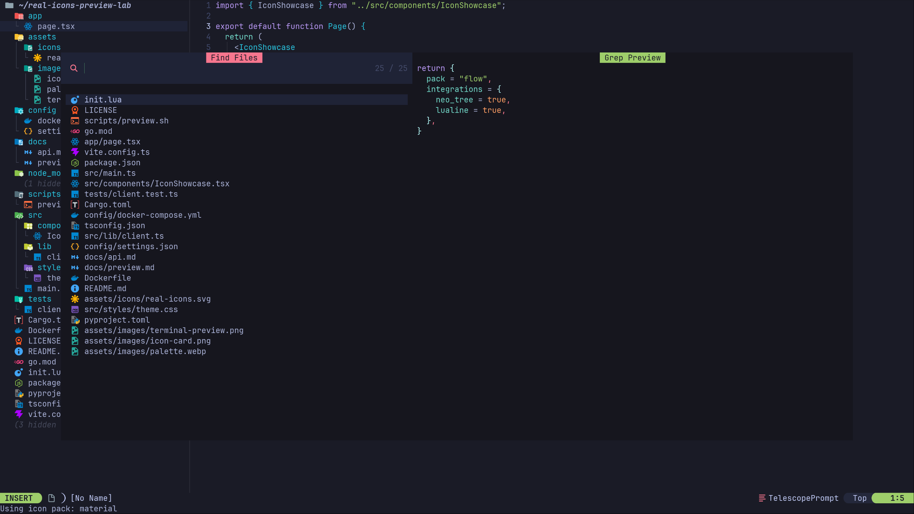
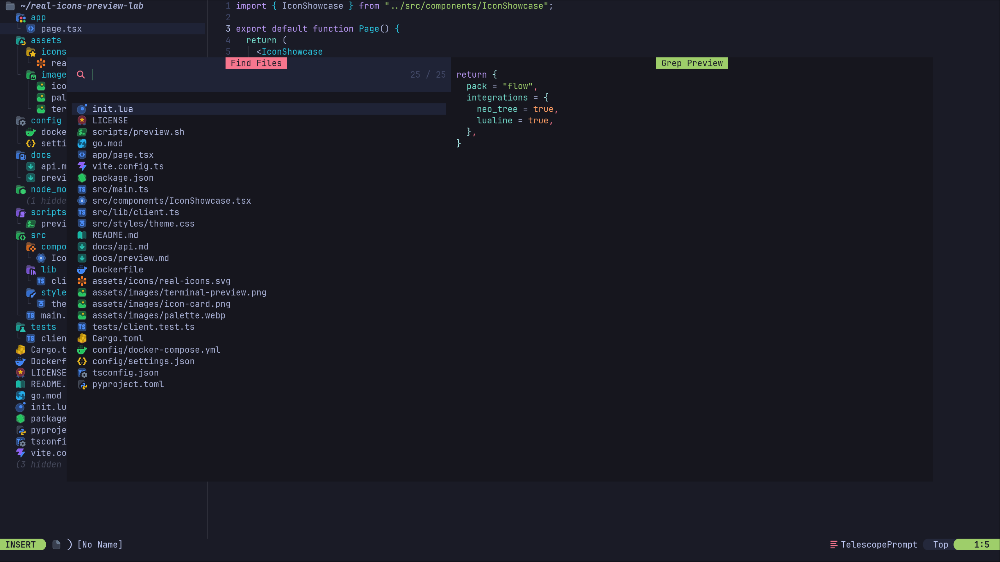

# real-icons.nvim

Graphical file icons for Neovim terminal UIs.

`real-icons.nvim` renders real image icons in places where Neovim plugins
normally use Nerd Font glyphs. It uses Kitty Graphics Protocol Unicode
placeholders, supports Ghostty and Kitty, supports tmux passthrough, and falls
back to glyph icons when image rendering is unavailable.

## Preview

Material Icon Theme:



Flow Icons local VS Code theme:



## Status

Experimental, usable today on Ghostty and Kitty. The renderer, Material Icon Theme
installer, SVG raster cache, custom icon packs, tmux passthrough, and listed
integrations are implemented. Public APIs may change before v1.0.

## What It Provides

- Real image icons rendered in terminal UI rows.
- SVG icon packs rasterized into a local high-density PNG cache.
- Cache-time icon color transforms for grayscale, tint, brightness, saturation,
  and hue adjustments.
- VS Code icon theme support, including private local icon packs.
- Opt-in integrations for popular Neovim file pickers, explorers, statuslines,
  and tablines.
- Glyph fallback for terminals or sessions where image rendering is not
  available.

## Requirements

- Neovim 0.10+
- Ghostty or Kitty
- `termguicolors`
- `magick` from ImageMagick for SVG icon packs and color transforms
- `curl` and `tar` for `:RealIconsInstallPack material`

For tmux, enable passthrough and RGB color support:

```tmux
set -g default-terminal "tmux-256color"
set -gq terminal-overrides[1] "*:Tc"
set -gq terminal-features[3] "xterm-ghostty:RGB"
set -g allow-passthrough on
```

## Installation

With lazy.nvim:

```lua
{
  "Mirsmog/real-icons.nvim",
  build = ":RealIconsInstallPack material",
  opts = {
    pack = "material",
    integrations = {
      telescope = true,
    },
  },
}
```

Run a quick check after installation:

```vim
:RealIconsHealth
:RealIconsDemo
```

If the Material pack is not installed, `real-icons.nvim` falls back to a small
bundled icon pack.

## Supported Integrations

| Plugin | Status | Setup style |
| --- | --- | --- |
| `telescope.nvim` | supported | automatic |
| `telescope-file-browser.nvim` | supported | manual entry maker |
| `oil.nvim` | supported | automatic |
| `nvim-tree.lua` | supported | automatic |
| `neo-tree.nvim` | supported | automatic or manual |
| `mini.files` | supported | automatic or manual |
| `bufferline.nvim` | supported | automatic or manual |
| `lualine.nvim` | supported | automatic or manual |
| `snacks.picker` | supported | automatic |

All integrations are opt-in.

## Configuration

Full default configuration:

```lua
require("real-icons").setup({
  pack = "material",
  packs = {},
  overrides = {},
  backend = "auto",
  size = {
    cols = 2,
    rows = 1,
    pixels = 64,
    padding = 0,
    trim = false,
  },
  color = {
    tint = nil,
    saturation = 0,
    brightness = 0,
    hue = 0,
    monochrome = false,
  },
  fallback = {
    enabled = true,
    provider = "auto",
  },
  integrations = {
    bufferline = false,
    lualine = false,
    mini_files = false,
    neo_tree = false,
    nvim_tree = false,
    oil = false,
    snacks_picker = false,
    telescope = false,
    telescope_file_browser = false,
  },
})
```

`backend = "auto"` detects Kitty Graphics Protocol compatible terminals.
`backend = "kitty"` forces the Kitty Graphics Protocol renderer, and
`backend = "disabled"` forces glyph fallback.

`size.cols` reserves terminal cells for the placeholder. `size.rows` currently
must be `1`.
`size.pixels` controls the generated PNG size. The default keeps SVG sources and
rasterizes them into a high-density PNG cache, which gives sharper icons than
using a small raster source.

If an icon pack has too much transparent padding, set `trim = true`. If icons
look too large after trimming, add `padding = 4` or `padding = 6`. After changing
size or color options, run:

```vim
:RealIconsClearCache material
```

Color transforms are applied while building the PNG cache:

```lua
require("real-icons").setup({
  color = {
    saturation = -100, -- grayscale
  },
})
```

```lua
require("real-icons").setup({
  color = {
    tint = "#89b4fa", -- replace icon colors while preserving alpha
  },
})
```

Use `brightness`, `saturation`, and `hue` as percentage offsets where `0` is
neutral. Aliases are also accepted: `lightness` for `brightness`, `mask` and
`mask_color` for `tint`, and `grayscale` for `monochrome`. A string value such
as `color = "#89b4fa"` is treated as a tint.

## Icon Packs

The recommended default pack is Material Icon Theme.

- Source: <https://github.com/material-extensions/vscode-material-icon-theme>
- Package: <https://www.npmjs.com/package/material-icon-theme>
- License: MIT

Install it with:

```vim
:RealIconsInstallPack material
```

The plugin stores installed packs under
`stdpath("data")/real-icons/packs/<name>` and generated PNG files under
`stdpath("cache")/real-icons`. Icon packs keep their upstream licenses and are
not vendored into this repository.

### Switching Packs At Runtime

Switch the active pack without restarting Neovim:

```vim
:RealIconsUsePack material
:RealIconsUsePack builtin
```

List configured packs:

```vim
:RealIconsPacks
```

From Lua:

```lua
require("real-icons").use_pack("material")
```

The command clears uploaded terminal image ids, clears existing real-icons
extmarks, redraws statusline and tabline UI, and emits:

```lua
User RealIconsPackChanged
```

Use that event if a custom integration needs to rebuild its own cached entries.

### Local VS Code Icon Themes

Any local VS Code icon theme can be used as a pack. This is useful for private
or commercial packs that should not be committed to this repository.

```lua
require("real-icons").setup({
  pack = "flow",
  packs = {
    flow = {
      type = "vscode",
      path = vim.fn.expand("~/.vscode-oss/extensions/thang-nm.flow-icons-2.0.3"),
      theme = "flow-deep",
      license = "personal",
    },
  },
})
```

If `theme` is omitted, the first icon theme from the extension `package.json` is
used. You can also point directly at a manifest:

```lua
require("real-icons").setup({
  pack = "flow",
  packs = {
    flow = {
      type = "vscode",
      path = "/path/to/flow-icons",
      manifest = "dim.json",
    },
  },
})
```

### Simple Local Packs

For a small folder of icons, use the simple loader:

```lua
require("real-icons").setup({
  pack = "my-icons",
  packs = {
    ["my-icons"] = {
      type = "simple",
      path = "~/icons",
      file = "file.svg",
      folder = "folder.svg",
      extensions = {
        lua = "lua.svg",
        ts = "typescript.svg",
        md = "markdown.svg",
      },
      filenames = {
        ["package.json"] = "nodejs.svg",
      },
      folders = {
        src = "folder-src.svg",
      },
    },
  },
})
```

### Overrides

Overrides sit above the active pack and are useful for replacing a few icons:

```lua
require("real-icons").setup({
  pack = "material",
  overrides = {
    extensions = {
      lua = "~/icons/custom-lua.svg",
    },
    filenames = {
      [".env"] = "~/icons/env.svg",
    },
    folders = {
      node_modules = "~/icons/node_modules.svg",
    },
  },
})
```

## Integrations

### telescope.nvim

Telescope core file pickers such as `oldfiles`, `find_files`, and `git_files`
use `telescope.make_entry.gen_from_file()` internally. Enable the integration
before Telescope builds file entries:

```lua
require("real-icons").setup({
  integrations = {
    telescope = true,
  },
})
```

### telescope-file-browser.nvim

`telescope-file-browser.nvim` has its own entry maker, so wire the adapter into
the extension config:

```lua
require("telescope").setup({
  extensions = {
    file_browser = {
      disable_devicons = true,
      entry_maker = require("real-icons.integrations.telescope_file_browser").entry_maker,
    },
  },
})

require("telescope").load_extension("file_browser")
```

### oil.nvim

Enable the adapter before opening Oil buffers:

```lua
require("real-icons").setup({
  integrations = {
    oil = true,
  },
})
```

For an already open Oil buffer:

```vim
:RealIconsOilEnable
```

### nvim-tree.lua

```lua
require("real-icons").setup({
  integrations = {
    nvim_tree = true,
  },
})
```

The adapter replaces only the file or folder icon segment. Git, diagnostics,
opened, hidden, modified, bookmark, and clipboard decorators remain owned by
`nvim-tree`.

### neo-tree.nvim

Automatic setup:

```lua
require("real-icons").setup({
  integrations = {
    neo_tree = true,
  },
})
```

Manual setup:

```lua
require("neo-tree").setup(require("real-icons.integrations.neo_tree").opts())
```

The adapter uses `default_component_configs.icon.provider`, so normal neo-tree
renderers, git status, diagnostics, modified markers, and selection markers
remain owned by neo-tree.

### mini.files

Automatic setup:

```lua
require("real-icons").setup({
  integrations = {
    mini_files = true,
  },
})
```

Manual setup:

```lua
require("mini.files").setup(require("real-icons.integrations.mini_files").opts())
```

The adapter uses `content.prefix`, the official mini.files hook for text shown
before entry names.

### bufferline.nvim

Automatic setup wraps `bufferline.setup()` and injects `get_element_icon`:

```lua
require("real-icons").setup({
  integrations = {
    bufferline = true,
  },
})
```

Manual setup:

```lua
require("bufferline").setup(require("real-icons.integrations.bufferline").opts())
```

### lualine.nvim

Automatic setup wraps `lualine.setup()` and inserts a real icon component before
`filename` or `filetype` components:

```lua
require("real-icons").setup({
  integrations = {
    lualine = true,
  },
})
```

Manual component usage:

```lua
require("lualine").setup({
  sections = {
    lualine_c = {
      require("real-icons.integrations.lualine").component,
      "filename",
    },
  },
})
```

### snacks.picker

```lua
require("real-icons").setup({
  integrations = {
    snacks_picker = true,
  },
})
```

The adapter patches `snacks.picker.format.filename` and leaves the rest of
Snacks picker formatting intact. This covers file-like picker entries that use
the built-in filename formatter, including files, recent files, buffers, git
status, and diagnostics.

## API

The public API follows the same shape as common Neovim icon providers: pass a
category and a name, get display text and a highlight group back.
The category is explicit by design; path-only shorthand is not supported.

```lua
local icons = require("real-icons")

local text, hl, is_default, meta = icons.get("file", "init.lua")
```

Supported categories:

```lua
icons.get("file", "init.lua")
icons.get("directory", "src")
icons.get("extension", "lua")
icons.get("filetype", "lua")
```

`icons.icon()` and `icons.get_icon()` are aliases for `icons.get()`.

For text-based plugin hooks such as pickers, statuslines, and tablines, use
`segment()` when you need width or metadata:

```lua
local segment = icons.segment("file", "init.lua")

return segment.text, segment.hl
```

Render an icon into a buffer-based UI with inline virtual text:

```lua
icons.render(bufnr, row, col, "file", "init.lua")
```

Advanced integrations can resolve the engine object directly:

```lua
local icon = icons.resolve("file", "init.lua")

icons.render(bufnr, row, col, icon)
```

List configured mappings:

```lua
vim.print(icons.categories())
vim.print(icons.list("extension"))
```

Check terminal support and active capabilities:

```lua
local icons = require("real-icons")

if icons.is_supported() then
  print(icons.backend())
end

vim.print(icons.capabilities())
```

Switch icon packs:

```lua
local icons = require("real-icons")

icons.use_pack("material")
print(icons.pack())
vim.print(icons.available_packs())
```

## Commands

| Command | Description |
| --- | --- |
| `:RealIconsHealth` | Run health checks. |
| `:RealIconsDemo` | Open a demo buffer. |
| `:RealIconsInstallPack material` | Install Material Icon Theme. |
| `:RealIconsBuildCache` | Build the PNG cache for the active pack. |
| `:RealIconsClearCache [name]` | Clear generated PNG cache. |
| `:RealIconsUsePack [name]` | Switch the active icon pack, or show the current pack. |
| `:RealIconsPacks` | List configured icon packs. |
| `:RealIconsOilEnable` | Attach the Oil integration to the current buffer. |

## Troubleshooting

Run `:RealIconsHealth` first. It checks terminal support, `termguicolors`,
ImageMagick, tmux passthrough, and the active icon pack.

If icons do not appear:

- Confirm you are running inside Ghostty or Kitty.
- Confirm `vim.o.termguicolors` is enabled.
- Install the default pack with `:RealIconsInstallPack material`.
- Run `:RealIconsDemo` outside tmux, then inside tmux.
- In tmux, confirm `set -g allow-passthrough on` is loaded.

If icons are blurry:

- Keep SVG packs as sources when possible.
- Increase `size.pixels`.
- Use `cols = 2` for one-row icons.
- Clear the cache after changing size or color options.

If a selected row hides the icon, the plugin integration must return the
`RealIconsImage...` highlight group for the icon segment. Report the integration
and plugin version if that happens in a supported integration.

## How It Works

1. Resolve a path to an icon key using VS Code icon theme mappings, a simple
   local pack, overrides, or the bundled fallback pack.
2. Convert image sources into cached PNG files at the configured pixel size.
3. Upload the PNG to the terminal through Kitty Graphics Protocol.
4. Place a `U+10EEEE` Unicode placeholder in the Neovim grid with the image id
   encoded in the foreground color.
5. In tmux, wrap the graphics upload in DCS passthrough.

The icon moves with the text grid, so integrations can use normal Neovim text
positions instead of absolute pixel placement.

## Limitations

- Ghostty and Kitty are the primary supported terminals.
- Image rendering depends on terminal support for Kitty Graphics Protocol
  Unicode placeholders.
- Unsupported terminals use glyph fallback when a fallback provider is
  available.
- Integrations are plugin-specific because each UI exposes different icon hooks.
- Public APIs may change before v1.0.

## Acknowledgements

`real-icons.nvim` stands on a few core projects:

- Neovim, which makes this kind of terminal UI experimentation possible.
- Kitty Graphics Protocol, which enables real image rendering in modern
  terminals.
- Ghostty, the first terminal target for this plugin.
- Material Icon Theme, the default open source icon pack target.

## License

`real-icons.nvim` is MIT licensed. Installed icon packs keep their upstream
licenses.
