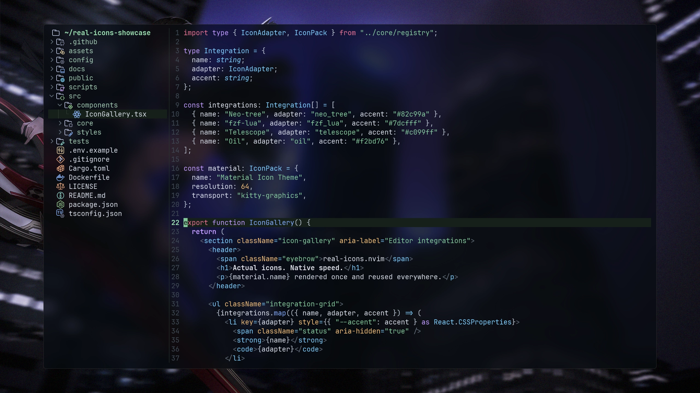
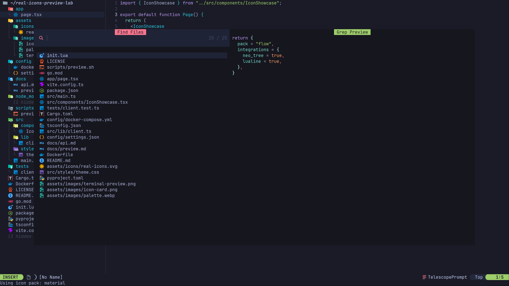
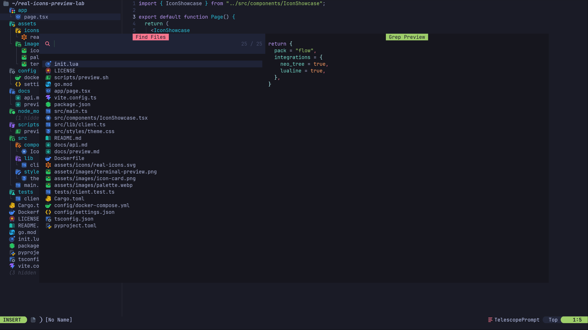

<div align="center">

# real-icons.nvim

**Real image icons inside Neovim, not font glyphs.**

[](https://neovim.io/)
[](LICENSE)
[](https://github.com/Mirsmog/real-icons.nvim/stargazers)

</div>

<p align="center">
  
</p>

<p align="center">
  <sub><a href="https://github.com/catppuccin/vscode-icons">Catppuccin Icons</a> in <a href="https://github.com/nvim-neo-tree/neo-tree.nvim">neo-tree.nvim</a></sub>
</p>

`real-icons.nvim` brings real file and folder icons from PNG and SVG themes to
explorers, pickers, statuslines, and tablines. It renders through the Kitty
Graphics Protocol in Ghostty and Kitty, works through configured tmux
passthrough, and safely falls back to glyphs in other terminals.

## Why real-icons?

| Real icons | Your icon themes | 10 integrations |
| --- | --- | --- |
| Render images with their original colors and shapes. | Use Material Icon Theme, local VS Code themes, or your own files. | Connect popular pickers, explorers, statuslines, and tablines. |

- No patched font is required for image rendering.
- SVG icons are converted once and cached automatically.
- Unsupported terminals keep working through `mini.icons` or
  `nvim-web-devicons` fallback.
- Directory rules can match full project paths without hardcoded framework
  behavior.

## Quick start

### Requirements

- Neovim 0.10+
- Ghostty or Kitty for image rendering
- `magick` from ImageMagick for SVG themes
- `curl` and `tar` for installing Material Icon Theme
- `termguicolors`

### lazy.nvim

```lua
{
  "Mirsmog/real-icons.nvim",
  build = ":RealIcons install",
  opts = {
    integrations = {
      neo_tree = true,
    },
  },
}
```

Replace `neo_tree` with any integration key from the table below, or enable
several.

To verify the renderer immediately:

```vim
:RealIcons demo
```

If Material Icon Theme is unavailable, the plugin uses its bundled fallback
pack, so installation never leaves Neovim without icons.

## One command

```vim
:RealIcons
```

With no arguments, `:RealIcons` opens a small menu. The same actions are
available as subcommands for configuration and scripts:

| Command | Purpose |
| --- | --- |
| `:RealIcons demo` | Preview the renderer |
| `:RealIcons packs` | Discover, preview, and switch icon packs |
| `:RealIcons install` | Install Material Icon Theme |
| `:RealIcons health` | Run health checks |
| `:RealIcons help` | Open the help page |
| `:RealIcons clear-cache [pack]` | Repair a stale or damaged cache |

Tab completion is available for every action. The standard command
`:checkhealth real-icons` works as well.

## Integrations

All integrations are opt-in. Add the matching key under `integrations`:

| UI | Configuration key | Setup |
| --- | --- | --- |
| [neo-tree.nvim](https://github.com/nvim-neo-tree/neo-tree.nvim) | `neo_tree` | automatic |
| [nvim-tree.lua](https://github.com/nvim-tree/nvim-tree.lua) | `nvim_tree` | automatic |
| [oil.nvim](https://github.com/stevearc/oil.nvim) | `oil` | automatic |
| [mini.files](https://github.com/nvim-mini/mini.files) | `mini_files` | automatic |
| [telescope.nvim](https://github.com/nvim-telescope/telescope.nvim) | `telescope` | automatic |
| [fzf-lua](https://github.com/ibhagwan/fzf-lua) | `fzf_lua` | automatic |
| [snacks.picker](https://github.com/folke/snacks.nvim) | `snacks_picker` | automatic |
| [bufferline.nvim](https://github.com/akinsho/bufferline.nvim) | `bufferline` | automatic |
| [lualine.nvim](https://github.com/nvim-lualine/lualine.nvim) | `lualine` | automatic |
| [telescope-file-browser.nvim](https://github.com/nvim-telescope/telescope-file-browser.nvim) | `telescope_file_browser` | entry maker |

For example, an fzf-lua and Oil setup only needs:

```lua
require("real-icons").setup({
  integrations = {
    fzf_lua = true,
    oil = true,
  },
})
```

Integrations preserve sorting, filtering, git status, diagnostics, and other UI
behavior.

<details>
<summary><strong>telescope-file-browser.nvim setup</strong></summary>

```lua
require("telescope").setup({
  extensions = {
    file_browser = {
      entry_maker = require("real-icons.integrations.telescope_file_browser").entry_maker,
    },
  },
})

require("telescope").load_extension("file_browser")
```

Caching, multi-selection, git columns, stat columns, and resize behavior
continue to work with the custom entry maker.

</details>

More integration details are available in
[`doc/real-icons.txt`](doc/real-icons.txt) and `:help real-icons-integrations`.

## Icon packs

Material Icon Theme is the recommended pack and is installed by the lazy.nvim
build command shown above. The small `builtin` pack is always available.

Run this to browse every configured pack and compatible VS Code theme found on
your machine:

```vim
:RealIcons packs
```

The picker scans the standard extension directories for VS Code, VSCodium,
Cursor, and Windsurf, and previews each theme before switching.

<details>
<summary><strong>More pack and integration previews</strong></summary>

### Material Icon Theme

<p align="center">
  
</p>

### Flow Icons

<p align="center">
  
</p>

</details>

<details>
<summary><strong>Use a theme from a custom location</strong></summary>

```lua
require("real-icons").setup({
  pack = "my_theme",
  packs = {
    my_theme = {
      type = "vscode",
      path = "/path/to/vscode-icon-theme",
      theme = "theme-id",
    },
  },
})
```

You can also point at a specific manifest instead of a theme identifier.

</details>

Simple local packs, per-file overrides, and the pack loader API are documented
under `:help real-icons-packs`.

## Configuration

Most setups only need integration keys. The defaults reserve two terminal
cells for one icon and automatically cache the correct size and color variant.

<details>
<summary><strong>Path-aware directory rule</strong></summary>

```lua
require("real-icons").setup({
  rules = {
    directories = {
      {
        glob = "**/packages/*/src/**",
        icon = "folder-packages",
      },
    },
  },
})
```

`*` stays inside one path segment and `**` crosses path separators. Rules are
generic and can target any project layout.

</details>

The complete option reference, including size, color, pack, and override
settings, lives in [`doc/real-icons.txt`](doc/real-icons.txt). Inside Neovim,
run `:help real-icons-setup`.

## Terminal support

| Environment | Result |
| --- | --- |
| Ghostty | real image icons |
| Kitty | real image icons |
| Ghostty or Kitty inside tmux | real image icons with passthrough enabled |
| WezTerm | safe glyph fallback |
| Other terminals and Neovide | glyph fallback when an icon provider is available |

<details>
<summary><strong>tmux configuration</strong></summary>

```tmux
set -g allow-passthrough on
```

</details>

WezTerm supports the base Kitty Graphics Protocol but not the Unicode
placeholders used to anchor images to Neovim cells. Until
[wezterm/wezterm#986](https://github.com/wezterm/wezterm/issues/986) lands,
`backend = "auto"` selects glyph fallback there.

## Troubleshooting

Start with:

```vim
:RealIcons health
```

It checks Neovim, the terminal, `termguicolors`, ImageMagick, tmux passthrough,
the selected icon pack, and enabled integrations.

If icons do not appear:

1. Run `:RealIcons demo` to isolate the renderer from integrations.
2. Run `:RealIcons install` if Material Icon Theme is missing.
3. Confirm `magick` is executable for SVG themes.
4. If tmux is active, confirm `allow-passthrough` is enabled.
5. Use `:RealIcons clear-cache` only if generated files are damaged or stale.

When reporting a problem, include the Neovim version, terminal name, plugin
version, and output from `:checkhealth real-icons`.

## How it works

1. A filename or directory path resolves to an image in the active icon pack.
2. SVG sources are rasterized once into a size and color-aware PNG cache.
3. The PNG is uploaded with Kitty Graphics Protocol.
4. A Unicode placeholder keeps the image attached to its Neovim grid cell.

The placeholder moves with the text grid, so integrations use normal text
positions instead of absolute pixel coordinates.

## Documentation and development

The help file covers the full configuration, Lua API, pack format, and adapter
contracts:

```vim
:help real-icons
```

Run the local test suite with:

```sh
make test
```

## Credits

- [Neovim](https://neovim.io/) for the editor and UI primitives.
- [Kitty Graphics Protocol](https://sw.kovidgoyal.net/kitty/graphics-protocol/)
  for terminal image rendering.
- [Material Icon Theme](https://github.com/material-extensions/vscode-material-icon-theme)
  for the recommended icon pack.
- [Catppuccin Icons](https://github.com/catppuccin/vscode-icons) and
  [Flow Icons](https://github.com/thang-nm/Flow-Icons) for themes shown in the
  previews.
- Ghostty and Kitty for implementing Unicode image placeholders.

## License

`real-icons.nvim` is licensed under the [MIT License](LICENSE). Installed icon
packs keep their upstream licenses.

<p align="center">
  If real-icons.nvim makes your setup better, consider giving the project a star.
</p>
