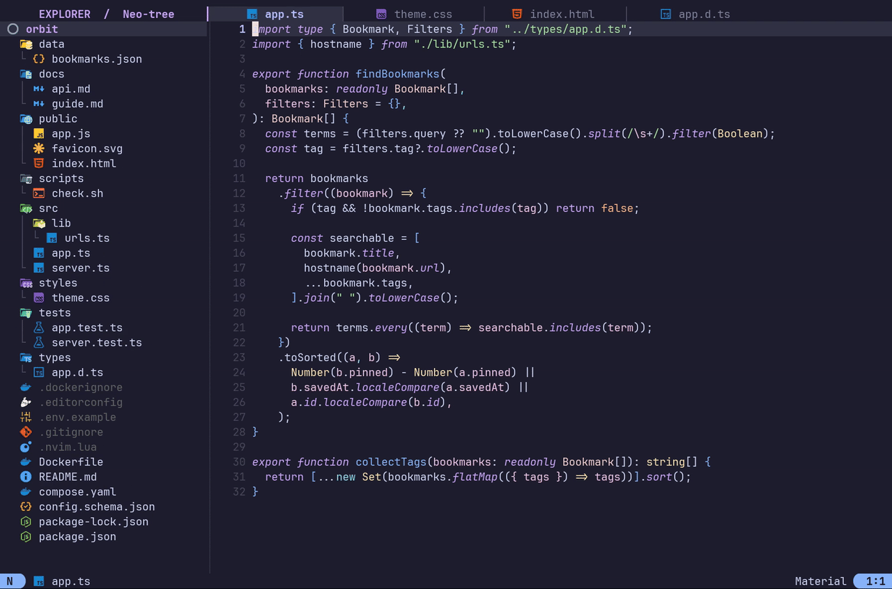
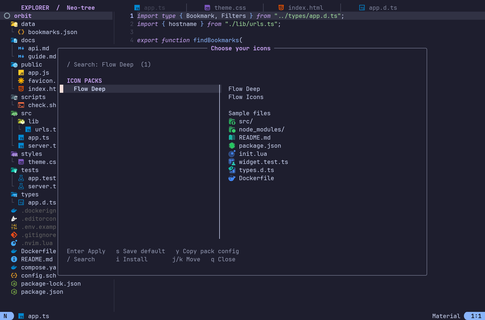
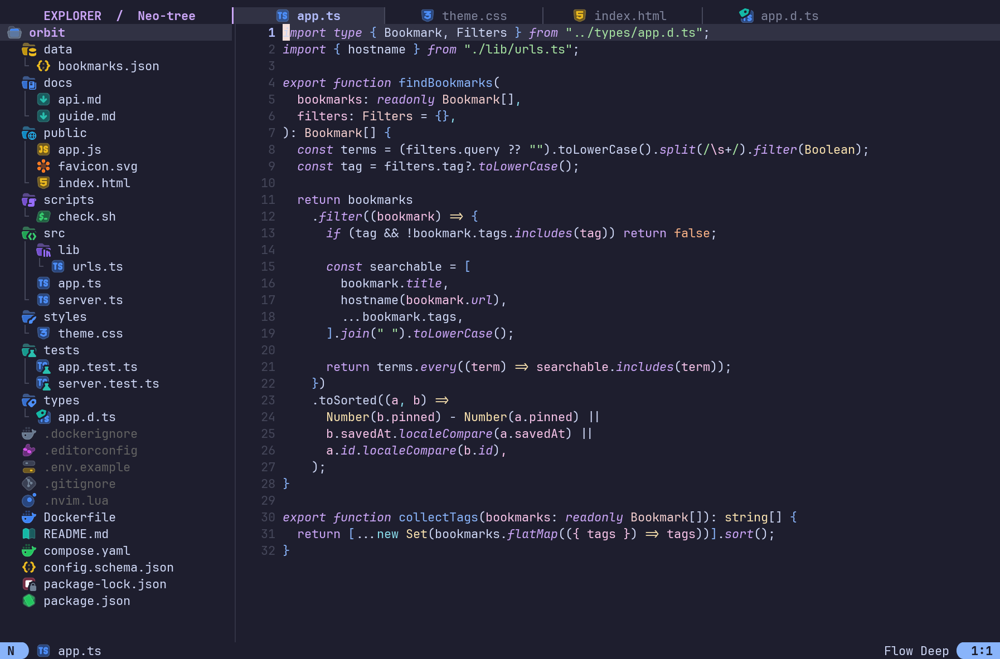
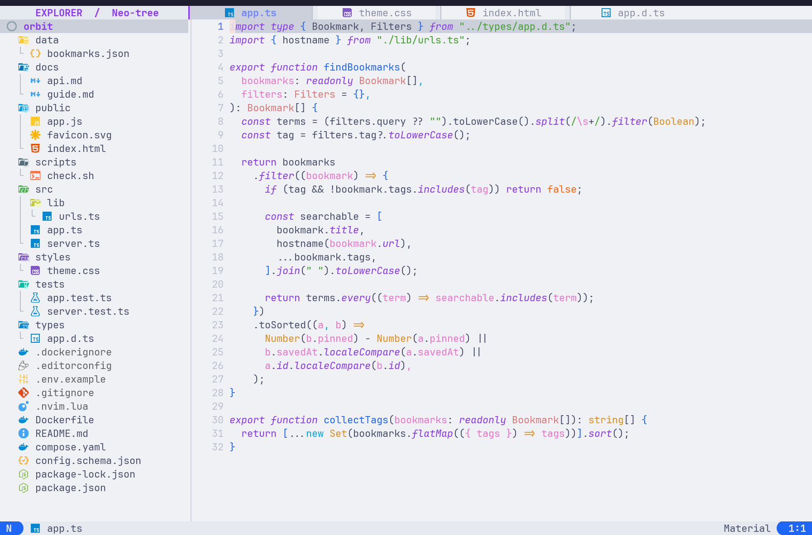
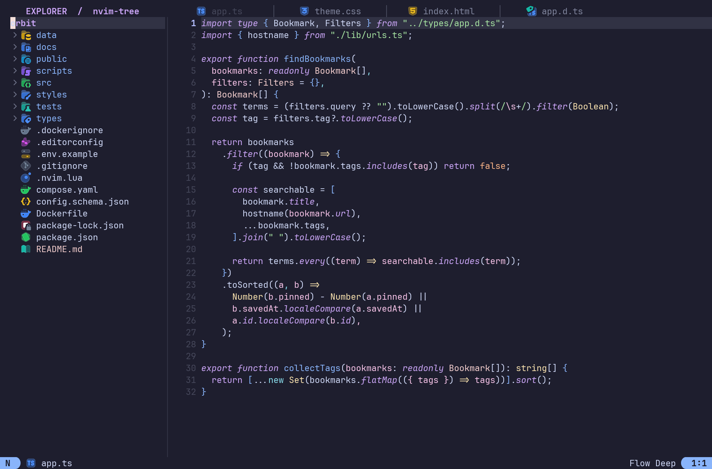

<div align="center">

# real-icons.nvim

**Your file icons, in full color.**

[Quick start](#quick-start) · [Icon packs](#icon-packs) · [Integrations](#integrations) · [Help](#troubleshooting)

Neovim 0.10+ · Ghostty & Kitty · [MIT](LICENSE)

</div>

<p align="center">
  <a href="media/showcase/demo.mp4">
    
  </a>
</p>

<p align="center">
  <a href="media/showcase/demo.mp4">Watch the full demo (69 seconds)</a>
</p>

PNG and SVG file icons for Neovim, rendered as images through the Kitty Graphics
Protocol. Use them in your file tree, fuzzy finder, statusline, and buffer tabs.

- **Bring your favorite icons.** Material Icon Theme, compatible VS Code icon
  themes, or a folder of your own images.
- **Preview before switching.** Browse packs, try them for a session, or save a
  default from the picker.
- **Match your workflow.** Ten opt-in integrations, compound file extensions,
  and custom file and folder rules.

Image icons do not need a Nerd Font. Other UI symbols and font-based fallbacks
may still need one.

## Quick start

### Requirements

- Neovim 0.10+
- Ghostty or Kitty for image icons; see [terminal support](#terminal-support)
- ImageMagick (`magick`) for SVG themes, including Material
- `curl` and `tar` for installing Material Icon Theme
- True color enabled: `vim.opt.termguicolors = true`

### lazy.nvim

Add this spec to your lazy.nvim plugins:

```lua
{
  "Mirsmog/real-icons.nvim",
  build = ":RealIcons install",
  opts = {
    integrations = {
      neo_tree = true,
    },
  },
}
```

The build step installs Material Icon Theme. Enable the
[integrations](#integrations) you use; their plugins must be installed and
configured separately.

Restart Neovim, then open the overview:

```vim
:RealIcons
```

From there, preview icons, choose a pack, or check your setup. If the build step
was skipped, run `:RealIcons install` to get Material. A small `builtin` pack is
included as a fallback.

<details>
<summary>Using another package manager</summary>

Install `Mirsmog/real-icons.nvim`, then call:

```lua
require("real-icons").setup({
  integrations = { neo_tree = true },
})
```

Run `:RealIcons install` once to download Material Icon Theme.

</details>

## Icon packs

Material Icon Theme is the default. To explore other packs:

```vim
:RealIcons packs
```

The picker finds compatible icon themes in your local VS Code, VSCodium,
Cursor, and Windsurf extension directories, alongside your configured packs.



| Key | Action |
| --- | --- |
| `j` / `k` or arrows | Browse packs and preview their icons |
| `/` | Search by name |
| `Enter` | Apply for this session |
| `s` | Apply and save as the default |
| `y` | Copy the pack's configuration fields |
| `i` | Install Material Icon Theme |
| `q` / `Esc` | Close |

An explicit `pack = "..."` in your config takes priority over the saved choice
on restart. Omit it if you prefer choosing your default in the picker.

Themes can provide light variants, expanded folder icons, and distinct icons
for extensions such as `.test.ts` and `.d.ts`.

<details>
<summary>Flow Deep and light-mode previews</summary>

**Flow Deep with Catppuccin Mocha**



**Material Icon Theme with Catppuccin Latte**



</details>

<details>
<summary>Load a VS Code icon theme from a custom location</summary>

```lua
require("real-icons").setup({
  pack = "my_theme",
  packs = {
    my_theme = {
      type = "vscode",
      path = "/path/to/vscode-icon-theme",
      theme = "theme-id",
    },
  },
})
```

Use the theme's ID from its `package.json`, or replace `theme` with
`manifest = "path/to/icons.json"`, relative to the pack directory.

For a folder of your own PNG or SVG files, see `:help real-icons-packs`.

</details>

## Integrations

Add any of these keys to `opts.integrations` in your plugin spec, or to
`integrations` in `setup()`. All are off by default.

| Plugin | Enable with |
| --- | --- |
| [neo-tree.nvim](https://github.com/nvim-neo-tree/neo-tree.nvim) | `neo_tree = true` |
| [nvim-tree.lua](https://github.com/nvim-tree/nvim-tree.lua) | `nvim_tree = true` |
| [oil.nvim](https://github.com/stevearc/oil.nvim) | `oil = true` |
| [mini.files](https://github.com/nvim-mini/mini.files) | `mini_files = true` |
| [telescope.nvim](https://github.com/nvim-telescope/telescope.nvim) | `telescope = true` |
| [telescope-file-browser.nvim](https://github.com/nvim-telescope/telescope-file-browser.nvim) | `telescope_file_browser = true` + hook below |
| [fzf-lua](https://github.com/ibhagwan/fzf-lua) | `fzf_lua = true` |
| [snacks.picker](https://github.com/folke/snacks.nvim) | `snacks_picker = true` |
| [bufferline.nvim](https://github.com/akinsho/bufferline.nvim) | `bufferline = true` |
| [lualine.nvim](https://github.com/nvim-lualine/lualine.nvim) | `lualine = true` |



<details>
<summary>telescope-file-browser.nvim: additional setup</summary>

Enable `telescope_file_browser = true`, then add the entry maker to your
Telescope configuration:

```lua
require("telescope").setup({
  extensions = {
    file_browser = {
      entry_maker = require("real-icons.integrations.telescope_file_browser").entry_maker,
    },
  },
})

require("telescope").load_extension("file_browser")
```

</details>

Open `:RealIcons` to check connection status. If an integration is missing,
load its plugin and press `r` in the overview to retry. See
`:help real-icons-integrations` for adapter-specific options.

## Configuration

Adjust icon size and color, override individual filenames, or assign folder
icons by project path. The full reference is in
[`doc/real-icons.txt`](doc/real-icons.txt) and `:help real-icons-setup`.

## Commands

`:RealIcons` opens the overview. These actions are also available directly:

| Command | Action |
| --- | --- |
| `:RealIcons demo` | Preview the renderer |
| `:RealIcons packs` | Browse and switch icon packs |
| `:RealIcons install` | Download Material Icon Theme |
| `:RealIcons health` | Check dependencies, terminal support, and integrations |
| `:RealIcons report` | Copy diagnostics for a bug report |
| `:RealIcons help` | Open the help page |
| `:RealIcons clear-cache [pack]` | Clear generated icons for one pack or all packs |

## Terminal support

| Environment | Result |
| --- | --- |
| Ghostty / Kitty | Image icons |
| Ghostty / Kitty inside tmux | Image icons with passthrough enabled |
| Other terminals, including WezTerm, and Neovide | Font icons with `backend = "auto"` |

For tmux, add this to your `.tmux.conf` and reload it:

```tmux
set -g allow-passthrough on
```

Image rendering uses Kitty's Unicode placeholders. The fallback uses
`mini.icons` or `nvim-web-devicons` when available, otherwise a generic file or
folder glyph. SVGs are converted in the background and cached; a font icon may
appear briefly while a new image is being prepared.

## Troubleshooting

If icons are missing, start with:

```vim
:RealIcons health
```

1. Run `:RealIcons demo`. If it shows images, check that your integration is
   enabled and its plugin is loaded.
2. For SVG packs, confirm `magick` is on your `PATH`. Run `:RealIcons install`
   if Material Icon Theme is missing.
3. Check [terminal support](#terminal-support), tmux passthrough, and
   `termguicolors` if the demo also falls back to font icons.
4. For stale or damaged generated icons, run `:RealIcons clear-cache`.

Still stuck? [Open an issue](https://github.com/Mirsmog/real-icons.nvim/issues)
with steps to reproduce and the output of `:RealIcons report` and
`:checkhealth real-icons`. Review the diagnostics before sharing them.

## Documentation

- [Help file](doc/real-icons.txt): configuration, pack formats, Lua API, and
  integration details. Also available as `:help real-icons`.
- [Contributing](CONTRIBUTING.md): running tests and reporting issues.

## Credits

- [Kitty Graphics Protocol](https://sw.kovidgoyal.net/kitty/graphics-protocol/)
  for terminal image rendering.
- [Material Icon Theme](https://github.com/material-extensions/vscode-material-icon-theme)
  and [Flow Icons](https://github.com/thang-nm/Flow-Icons) for the icon packs
  shown here.
- [Catppuccin](https://github.com/catppuccin/nvim) for the Mocha and Latte
  colorschemes in the demo.

## License

[MIT](LICENSE). Icon packs retain their upstream licenses.
